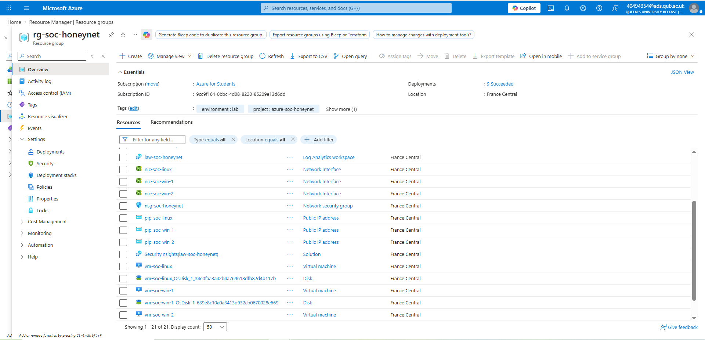
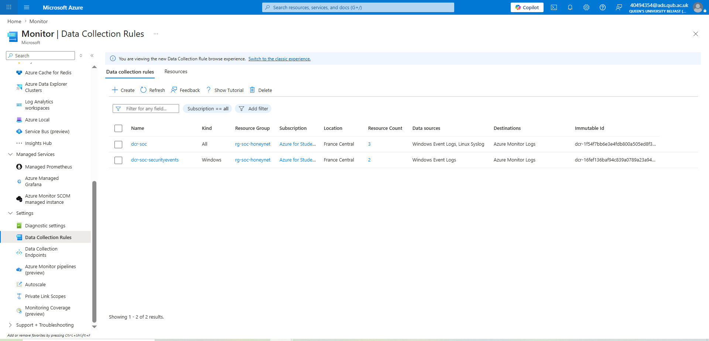
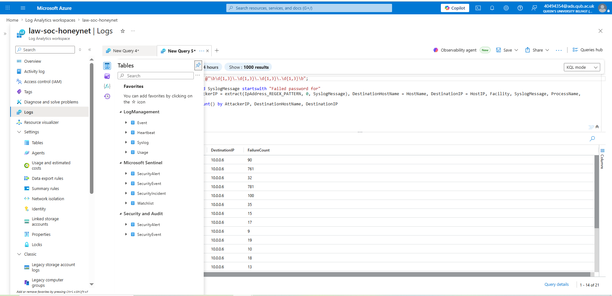
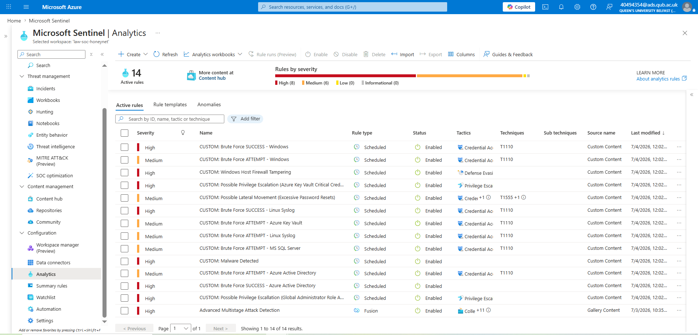
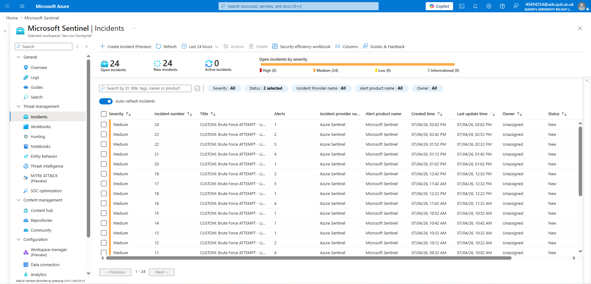
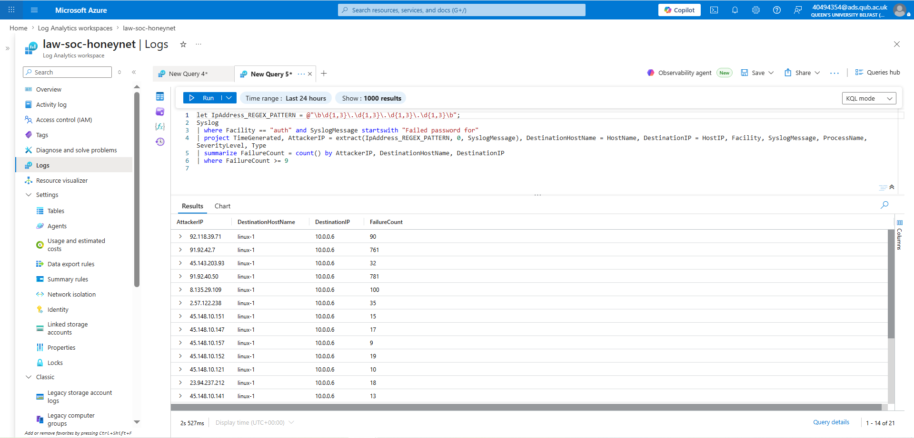
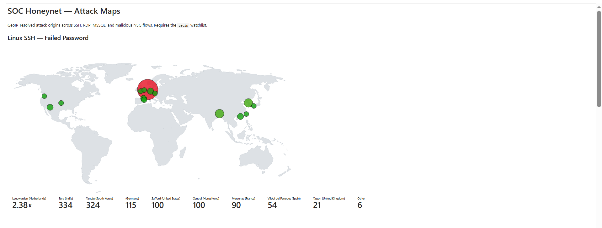
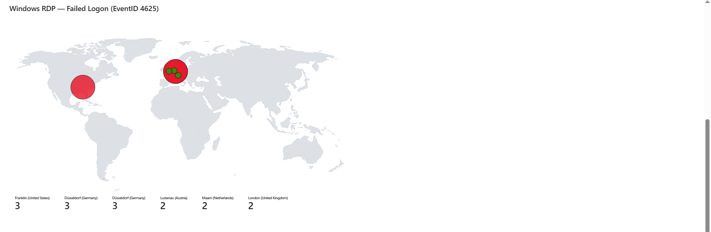

# Building a SOC + Honeynet in Azure (Live Attack Traffic)

A cloud honeynet built in Microsoft Azure that ingests logs from intentionally
internet-exposed VMs into a Log Analytics workspace, uses **Microsoft Sentinel**
with custom KQL analytics rules to generate alerts, incidents, and geo attack
maps, and then hardens the environment to measure the reduction in attack
surface. The infrastructure is deployed with **Terraform**; the SOC content
(watchlist, analytics rules, workbooks, and a response playbook) is layered on
top of it.

> **Ethics & scope:** this is a deliberately vulnerable *lab* honeynet running in
> an isolated subscription. The VMs hold no real data or credentials, and the
> environment is torn down after measurement. Do not deploy this against
> production networks.

## Architecture

- **Region / subscription:** France Central, isolated lab subscription
- **Compute:** 2× Windows Server 2022 + 1× Ubuntu 22.04 (honeynet targets)
- **Network:** VNet + subnet + NSG (deny-by-default, opened to the Internet only
  to collect the "insecure" window)
- **Telemetry:** Azure Monitor Agent + Data Collection Rules → Log Analytics
  (`SecurityEvent`, `Syslog`)
- **SIEM/SOAR:** Microsoft Sentinel — GeoIP watchlist, 14 scheduled analytics
  rules, attack-map workbook, and a manual "ban attacker IP" playbook (Logic App)

Telemetry data flow:

```
Attacker (Internet)  ──►  Honeynet VMs  ──AMA + DCR──►  Log Analytics
                                                            │
                          ┌─────────────────────────────────┤
                          ▼                                  ▼
                Sentinel analytics rules            Attack-map workbook
                  → SecurityAlert                     (GeoIP watchlist join)
                  → SecurityIncident
                          │
                          ▼
                Manual playbook → NSG deny rule (ban IP)
```

---

## Deployed environment

The full honeynet — 21 resources in one resource group (VMs, NICs, public IPs,
NSG, Log Analytics workspace, and the Microsoft Sentinel `SecurityInsights`
solution).



**Data Collection Rules** driving the Azure Monitor Agent. `dcr-soc` collects
Windows Event Logs + Linux Syslog; `dcr-soc-securityevents` (created by the
Sentinel "Windows Security Events via AMA" connector) routes Windows Security
events into the `SecurityEvent` table.



Once telemetry flows, the workspace exposes the SOC tables — `Syslog`, `Event`,
`Heartbeat` under LogManagement, and `SecurityEvent`, `SecurityAlert`,
`SecurityIncident`, and the `Watchlist` under Microsoft Sentinel.



---

## Detection — Sentinel analytics rules

14 scheduled analytics rules (custom KQL), mapped to MITRE ATT&CK tactics —
brute-force (Credential Access, T1110) across Linux SSH, Windows RDP, MS SQL, and
Azure AD; plus privilege escalation, lateral movement, firewall tampering, and
malware detections.



When the honeynet was exposed, these rules fired continuously against the live
brute-force traffic, producing a steady stream of incidents.



---

## Hunting — who is attacking

A KQL hunting query over the `Syslog` table extracts the attacker source IP from
each "Failed password for" SSH event and ranks them by attempt count. Individual
IPs racked up hundreds of failed logins in a single window (e.g. `91.92.40.50`
with 781 attempts, `91.92.42.7` with 761).



---

## Attack maps (GeoIP-resolved)

The attack-map workbook joins the source IPs against a GeoIP watchlist
(`ipv4_lookup`) and plots the origin of every attack.

**Linux SSH — Failed Password.** Thousands of failed SSH logins from around the
world; top origins include Leeuwarden (Netherlands, 2.38k), Tura (India), Yangju
(South Korea), Germany, the US, Hong Kong, France, and Spain.



**Windows RDP — Failed Logon (EventID 4625).** RDP brute-force origins across the
US and Europe (Franklin US, Düsseldorf Germany, Lustenau Austria, Maarn
Netherlands, London UK).



---

## Results — before vs. after hardening

The honeynet was measured over a ~24h **insecure** window, then hardened
(NSG lockdown / JIT VM access / Defender recommendations) and measured again.
The insecure window alone generated **24 brute-force incidents** and thousands of
failed-logon events resolved to attackers on multiple continents.

| Metric              | Before hardening (insecure) | After hardening |
| ------------------- | --------------------------- | --------------- |
| Syslog (Linux)      | thousands of failed SSH     | _fill in_       |
| SecurityEvent (Win) | RDP 4625 failures           | _fill in_       |
| SecurityIncident    | 24                          | _fill in_       |
| Unique attacker IPs | 21+ (single window)         | _fill in_       |

> Replace the "after" column and finalise the "before" numbers with your own
> 24h count-query results (see [docs/NEXT-STEPS.md](docs/NEXT-STEPS.md) Step 7).

---

## Repository layout

| Path | What |
| ---- | ---- |
| [`deploy/`](deploy/) | Terraform for the VMs + network |
| [`deploy/*.tf`](deploy/) | VNet, subnet, deny-by-default NSG, 2 Windows + 1 Linux VM |
| [`docs/NEXT-STEPS.md`](docs/NEXT-STEPS.md) | Step-by-step SOC build guide (Portal + CLI for every step) |
| [`docs/SOC-WALKTHROUGH.md`](docs/SOC-WALKTHROUGH.md) | Analyst triage runbook (detect → investigate → respond → measure) |
| [`docs/PLAYBOOK-BAN-IP.md`](docs/PLAYBOOK-BAN-IP.md) | Setup + manual-run guide for the ban-IP playbook |
| [`azure-soc-honeynet-main/`](azure-soc-honeynet-main/) | SOC content: KQL analytics rules, GeoIP CSV, map queries, merged attack-map workbook, and the ban-IP playbook |

## Deploy it yourself

```bash
cd deploy
export TF_VAR_admin_password='<a complex 12+ char password>'
terraform init
terraform apply            # 15 resources (VMs + network)
```

Then follow [docs/NEXT-STEPS.md](docs/NEXT-STEPS.md) to add the monitoring stack
and Sentinel content, open the honeynet, and collect metrics. When finished, run
`terraform destroy` in `deploy/` to stop billing and close the exposure.

## Credits

Inspired by Josh Madakor's "SOC + Honeynet in Azure" lab, rebuilt here as a
Terraform-deployed, modernized (Azure Monitor Agent + DCR) version with an added
SOAR response playbook.
